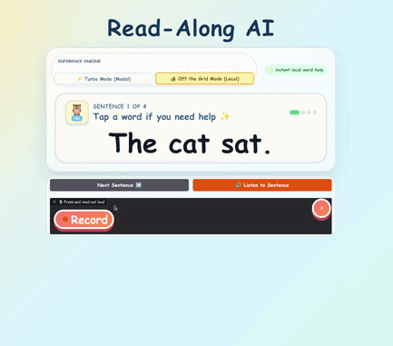

# 🦉 Read-Along AI: The Offline Reading Teacher

**Live App:** [read-along-ai](https://huggingface.co/spaces/build-small-hackathon/read-along-ai)

**Organization:** Hosted under the official [`build-small-hackathon`](https://huggingface.co/build-small-hackathon) HF Org.

**A Build Small Hackathon Submission**
*Track: Backyard AI*

## 📖 The Vision

Learning to read is a monumental milestone, but standard voice-to-text models demand perfect diction. They treat a child's developing voice like a series of errors, turning practice into a frustrating test. **Read-Along AI** was built to fix this: it is a patient, distraction-free reading assistant that listens to a child read and provides instant, gentle feedback.

As a homeschooling parent to four young children, managing daily reading practice can be chaotic. I built this tool for the **Backyard AI** track to solve a specific problem for the people I know best: to remove the friction from the daily reading curriculum for my 7-year-old son and 6-year-old daughter. Read-Along AI acts as an offline safety net—allowing them to sound out words at their own pace without the anxiety of a ticking clock, and without the privacy risks of sending their voices to a corporate cloud server.

**Real-World Impact:** When I field-tested this with my kids, the engagement was immediate. Because the fine-tuned phonetic judge gracefully accepted their natural speech variations—and the gamified confetti cannon fired instantly upon a successful read—they voluntarily asked to keep "playing" through their reading assignment. It successfully transformed a high-friction task into an independent, confidence-building activity.

Crucially, because this tool is for young learners, it requires absolute data privacy. It relies exclusively on localized, small-parameter models to ensure a child's voice data never enters a corporate data lake.

## 🛠️ The Tech Stack & Architecture
This application strictly adheres to the < 32B parameter constraint, utilizing highly optimized small models for a real-time, fluid user experience.

### Development Documentation
For a deep dive into the architecture and development plan, please review our spec documents:
* [Product Specification](docs/PRODUCT_SPEC.md)
* [UI/UX & Frontend Specification](docs/UI_UX_SPEC.md)
* [API & Backend Contract](docs/API_CONTRACT_SPEC.md)
* [Deployment Strategy](docs/DEPLOYMENT_SPEC.md)
* [Hackathon Roadmap](docs/ROADMAP.md)

### Components
* **Frontend:** A custom, gamified Gradio interface ("Off-Brand" UI) built for legibility and young readers, with a custom HTML reading canvas, child-sized controls, local CSS/JS reward effects, and hidden Gradio chrome.
* **ASR (Speech-to-Text):** **Cohere Transcribe** (2B parameters) in Turbo Mode and `faster-whisper` `tiny.en` in Off the Grid Mode.
* **Reading Evaluator:** A fine-tuned **MiniCPM phonetic evaluator** (`kingkw1/minicpm-phonetic-evaluator`) judges close or ambiguous ASR transcripts after exact normalized matching. The tracked model card source lives at [`docs/model_cards/minicpm-phonetic-evaluator.md`](docs/model_cards/minicpm-phonetic-evaluator.md).
* **TTS / Audio Help:** **OpenBMB VoxCPM** (0.5B parameters) powers Modal Turbo Mode and was used to generate local curriculum audio assets. Off the Grid Mode defaults to committed sentence WAVs plus label-sliced word clips for responsive local assistance.
* **Compute / Inference:** Utilizes a **Dual-Mode Hybrid Architecture**. The app includes **Turbo Mode** for Modal serverless endpoints and **Off the Grid Mode** for local Hugging Face Space resources.

### Dual-Mode Inference Engine
The app deliberately ships with both inference paths:

* **🏕️ Off the Grid Mode (Local):** Runs inside the Hugging Face Space without Modal. Local ASR uses `faster-whisper`, the phonetic evaluator loads the Q4 MiniCPM GGUF through `llama-cpp-python`, and audio assistance uses committed curriculum WAVs from `data/curriculum_audio/` with word clips sliced from label timings. Live local VoxCPM is available only as an optional fallback with `LOCAL_LIVE_TTS=1`.
* **⚡ Turbo Mode (Modal):** Routes the same Gradio UI through Modal endpoints for low-latency Cohere ASR, VoxCPM TTS, and the hosted MiniCPM evaluator.

For final judging, Off the Grid Mode should be verified on the live Space with Modal credentials absent or unused. The Q4 GGUF is resolved from `LOCAL_MINICPM_GGUF_PATH`, `models/gguf/minicpm-phonetic-evaluator-q4_k_m.gguf`, or downloaded into the Space cache from `kingkw1/minicpm-phonetic-evaluator` as `minicpm-phonetic-evaluator-q4_k_m.gguf`. This keeps the Space repository under the free 1 GB storage limit while still running the evaluator locally through `llama.cpp`.

### Badge Verification Notes
* **Off the Grid:** The live Space has been verified in Off the Grid Mode on a short recorded sentence. The local path runs without Modal calls: `faster-whisper` transcribes the microphone audio, committed curriculum WAVs provide sentence and word audio help, and the MiniCPM evaluator runs from local GGUF weights after the Space caches the model file.
* **Llama Champion:** The phonetic evaluator loads `minicpm-phonetic-evaluator-q4_k_m.gguf` through `llama-cpp-python`, the Python binding for `llama.cpp`.
* **Runtime note:** A roughly 3-second reading attempt currently takes about 10 seconds end-to-end in local mode on the deployed Space. This is acceptable for the hackathon MVP and keeps the privacy-preserving path demonstrable.
* **Scope note:** “Off the Grid” here means no external/cloud inference APIs during local mode. The Space may download model weights from Hugging Face into its cache, but inference itself runs in the Space process.

## 🏆 Hackathon Eligibility & Attributions

### OpenAI Codex Track ($10,000)
This entire application, including the Gradio UI and backend Modal logic, was orchestrated using OpenAI's **Codex (GPT-5.5)**. Codex acted as the lead developer in a truly holistic manner:
* Generated the custom CSS overrides for the Off-Brand gamification.
* Wrote the Modal serverless stub functions and the Gradio abstraction wrappers.
* Managed the repository structure and environment variable integration.

* **GitHub Repository:** https://github.com/kingkw1/read-along-ai
* *Note to Judges: Please see the commit history for automated Codex attributions.*

### Modal Compute Awards
The high-speed inference endpoints powering the primary "Turbo Mode" are hosted entirely on **Modal**. This provides the necessary sub-second response times required to keep a young child focused. We also utilized Modal A100s for a rapid fine-tuning job to train the phonetic evaluator model.

### Local Verification
The repository includes a local-only smoke script for the Space path:

```bash
python scripts/manual/local_smoke.py
```

This script imports `local_inference.py`, resolves the Q4 GGUF, transcribes a committed curriculum audio file with `faster-whisper`, and calls the MiniCPM judge through `llama-cpp-python`. The app's default local demo path uses committed curriculum WAVs for audio help; live local VoxCPM can be enabled explicitly with `LOCAL_LIVE_TTS=1` for fallback testing. It does not require Modal credentials.

If the Q4 GGUF is not already published in the model repo, upload it once with:

```bash
./scripts/upload_gguf_to_hub.sh
```

For quick Hugging Face UI/CSS iteration without rebuilding the local inference stack, deploy the lightweight UI profile:

```bash
COMMIT_MESSAGE="UI polish" ./scripts/deploy_space.sh --target ui --yes
```

Use the default local profile for final Off the Grid verification:

```bash
COMMIT_MESSAGE="Enable local Off the Grid inference" ./scripts/deploy_space.sh --target main --yes
```

### Badges Claimed (Bonus Quest Champion Strategy)
* 🏅 **Off-Brand:** The default Gradio UI has been completely overhauled into a child-facing reading app. Evidence:
  * The reading prompt is rendered through custom `gr.HTML`, not a stock textbox, so each word is a keyboard-accessible clickable span with instant word help.
  * `assets/read_along.css` hides default Gradio chrome/API links, restyles the global shell, replaces the stock audio recorder surface with a large read-aloud control, and adds a custom mascot/progress treatment.
  * `assets/read_along.js` owns the word-help playback path and success auto-advance; the celebration uses a center-burst `canvas-confetti` effect with a local DOM/CSS fallback.
  * The visible workflow is sentence-first and child-sized: no data-science panels, exposed API widgets, or default component labels in the main learning loop.
* 🏅 **Well-Tuned:** [`kingkw1/minicpm-phonetic-evaluator`](https://huggingface.co/kingkw1/minicpm-phonetic-evaluator)
* 🏅 **Tiny Titan:** Every individual model used in this pipeline (and their combined footprint) is strictly under the 4B parameter threshold.
  * *Parameter Math:* Cohere Transcribe/faster-whisper (2B / 0.04B) + OpenBMB VoxCPM (0.5B) + MiniCPM Evaluator (2.4B) = ***2.9B Total Parameters***.
* 🏅 **Off the Grid:** The app includes a UI toggle that disconnects from Modal and runs `faster-whisper` plus the MiniCPM evaluator through `llama.cpp` locally inside the Hugging Face Space. Local sentence and word audio assistance comes from committed WAV assets, with live local VoxCPM kept as an opt-in fallback.
* 🏅 **Llama Champion:** The local phonetic evaluator runs the Q4 GGUF through `llama-cpp-python`.
* 🏅 **Sharing is Caring:** [read-along-ai-agent-traces](https://huggingface.co/datasets/kingkw1/read-along-ai-agent-traces)
* 🏅 **Field Notes:** [Building Read-Along AI: Field Notes from a Small-Model Reading Tutor](https://dev.to/kingkw1/building-read-along-ai-field-notes-from-a-small-model-reading-tutor-3e11) ([repo mirror](docs/FIELD_NOTES.md))

### Off-Brand UI Evidence
The Gradio layer is used as the app runtime and event system, while the child-facing surface is custom HTML, CSS, and JavaScript designed for early readers. The intended judging view is a purpose-built reading app: one large sentence, tap-to-hear words, a simple read-aloud control, progress feedback, and celebration animation.

* **Desktop screenshot:** *[Insert screenshot of the live Space showing the custom reading canvas, mascot/progress row, engine toggle, and microphone control]*
* **Mobile/tablet screenshot:** *[Insert narrow-screen screenshot proving the child-facing UI remains readable and polished on a family device]*
* **Celebration clip:** 
* **Default-Gradio contrast note:** Unlike standard Gradio interfaces designed for data scientists, Read-Along AI completely hides all API widgets, raw model outputs, and default component chrome, ensuring the child only interacts with a distraction-free, gamified reading canvas.

## 🚀 How It Works
The hackathon MVP is focused on a stable sentence-reading loop:
1. **Choose a sentence:** The app displays one short curriculum sentence in large, clickable text.
2. **Get help when needed:** The child can tap a word to hear a cached clip, or press "Listen to Sentence" for the committed local sentence WAV in Off the Grid Mode. Turbo Mode continues to use VoxCPM through Modal.
3. **Read aloud:** The child records an attempt through the microphone.
4. **Evaluate gently:** The app accepts exact normalized matches immediately, then asks the fine-tuned MiniCPM evaluator to judge close child-speech or ASR variants.
5. **Celebrate or retry:** Correct readings trigger confetti and advance to the next sentence; rejected readings get a simple, encouraging retry prompt.

Earlier phonics and CVC word levels were intentionally deferred. The current submission prioritizes reliability, privacy, and demo clarity around short-sentence reading practice.

### How It Handles Imperfect Child Speech
Read-Along AI is intentionally more patient than a plain transcript matcher, but it is not a permissive "anything goes" checker.

The evaluation path has two stages:

1. **Exact normalized match:** The app first strips casing and punctuation noise, then accepts clean readings immediately. A child should not wait on an LLM when they clearly read the sentence.
2. **Fine-tuned phonetic judgment:** If the transcript is close but not exact, the app asks the fine-tuned MiniCPM evaluator whether the child appears to have attempted the target sentence. This is meant for cases like early articulation, ASR substitutions, or dialectal/phonetic variants.

For example, the evaluator can accept a child-like variant such as **"Da dog ran fast"** for **"The dog ran fast"** because the target words and meaning are preserved. It should reject a changed-meaning reading such as **"She had a blue hat"** for **"She had a red hat"** because the important word changed. The product goal is developmentally fair feedback: reward real reading effort, fail closed when the sentence meaning changes, and keep the retry prompt gentle.

## 💻 Running Locally
The submitted Hugging Face Space is the official judging artifact, but the same app can run on a local machine for privacy testing and Off the Grid verification.

### 1. Create an environment
Use Python 3.11, then install the repository dependencies:

```bash
python -m venv .venv
source .venv/bin/activate
python -m pip install -r requirements.txt
```

### 2. Run the local app
Start the Gradio app from the repository root:

```bash
python app.py
```

Open the local URL printed by Gradio, usually `http://127.0.0.1:7860`, and select **🏕️ Off the Grid Mode (Local)** in the app. In this mode, microphone recordings are transcribed by local `faster-whisper`, the MiniCPM evaluator runs through `llama-cpp-python`, and sentence/word help uses committed curriculum audio from `data/curriculum_audio/`.

### 3. Model weight behavior
The Q4 MiniCPM GGUF is intentionally not committed to the Space repository because of the 1 GB storage limit. Local mode resolves it in this order:

1. `LOCAL_MINICPM_GGUF_PATH`
2. `models/gguf/minicpm-phonetic-evaluator-q4_k_m.gguf`
3. Hugging Face cache download from `kingkw1/minicpm-phonetic-evaluator`

For a fully offline localhost demo, run the app once while connected so the model can be cached, or point `LOCAL_MINICPM_GGUF_PATH` at an existing local GGUF file before disconnecting.

### 4. Run the local smoke test
The local smoke test verifies the same privacy-preserving path without starting the UI:

```bash
python scripts/manual/local_smoke.py
```

It transcribes a committed curriculum WAV with `faster-whisper`, resolves the GGUF evaluator, and asks MiniCPM to judge the target sentence. Modal credentials are not required for this path. Turbo Mode is optional and only uses Modal when `MODAL_TOKEN_ID` and `MODAL_TOKEN_SECRET` are configured.

## 📹 Submission Links
* **Demo Video:** [YouTube Video](https://youtu.be/4bpbwhipLU4)
* **Social Post:** [Hugging Face post](https://huggingface.co/posts/kingkw1/522163043386016)
* **X/Twitter Cross-Post:** [kingkw1_dev status](https://x.com/kingkw1_dev/status/2066382453539803570)
* **Field Notes:** [dev.to write-up](https://dev.to/kingkw1/building-read-along-ai-field-notes-from-a-small-model-reading-tutor-3e11)

## 👥 Team
* Hugging Face Username: `kingkw1`

### About the Developer
**Kevin King** is a Senior Machine Learning Engineer and AI Research Scientist with an M.S. in Neural and Electrical Engineering. With over seven years of enterprise MLOps experience, he specializes in multimodal signal fusion, neuro-symbolic architectures, and the deployment of local-first, air-gapped AI systems for resource-constrained environments.

Kevin has a proven track record of engineering highly optimized, award-winning agentic workflows. His previous hackathon builds include **AffectLink** (a real-time multimodal emotion recognition pipeline that won 1st Place in the 2025 HP & NVIDIA Developer Challenge) and **The Lung Listener** (Winner of the 2026 Google Gemini API Hackathon). *Read-Along AI* represents a continuation of his focus on privacy-preserving, localized AI that solves tangible, real-world problems.

## 📜 Open Source License
This project is licensed under the MIT License.

## Future Roadmap: Real-Time Streaming
The long-term V2 architecture will move from batch-style audio processing to real-time WebSocket streaming so young readers can receive instant visual feedback as they speak. The goal is to dynamically highlight each word on the page using word-level ASR timestamps, creating a tighter read-aloud loop for 4, 6, and 7-year-old learners.

For the 9-day hackathon MVP, real-time streaming was intentionally deferred to protect stability, privacy, and demo reliability. The planned post-hackathon architecture will refactor Gradio audio capture to use `streaming=True`, convert Modal inference endpoints into continuous generators, and extract word-level timestamps from the ASR model for live word highlighting.
